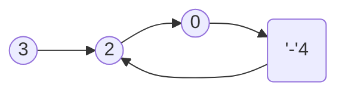
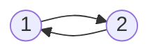

# 141. Linked List Cycle
Given a linked list, determine if it has a cycle in it.

To represent a cycle in the given linked list, we use an integer pos which represents the position (0-indexed) in the linked list where tail connects to. If pos is -1, then there is no cycle in the linked list.

Example 1:        
Input: head = [3,2,0,-4], pos = 1    
Output: true    
Explanation: There is a cycle in the linked list, where tail connects to the second node.


Example 2:    
Input: head = [1,2], pos = 0    
Output: true    
Explanation: There is a cycle in the linked list, where tail connects to the first node.


Example 3:    
Input: head = [1], pos = -1    
Output: false    
Explanation: There is no cycle in the linked list.    


輸入範本如下
```C#
/**
 * Definition for singly-linked list.
 * public class ListNode {
 *     public int val;
 *     public ListNode next;
 *     public ListNode(int x) {
 *         val = x;
 *         next = null;
 *     }
 * }
 */
public class Solution {
    public bool HasCycle(ListNode head) {
        
    }
}
```


### 直覺想法
1. 若是有 cycle 的話 , 則一直走訪 , 一定會走過重複的點. 因此可以用一個 set 把走過的點都記錄下來.
    ```C#
    96 ms	26.8 MB
    You are here!
    Your runtime beats 76.64 % of csharp submissions.
    public bool HasCycle(ListNode head)
    {
        HashSet<ListNode> set = new HashSet<ListNode>();
        while (head != null)
        {
            if (!set.Add(head))
            {
                return true;
            }
            head = head.next;
        }
        return false;
    }
    ```

2. 題目建議可否使用 O(1)的記憶體空間.
    - 使用兩個 point , 一個跑得比較快 , 一個跑的慢. 若是有 cycle , 快的那個 , 總有一天會追到慢的. 
    ```C#
    92 ms	25.3 MB
    You are here!
    Your runtime beats 91.25 % of csharp submissions.
    public bool HasCycle(ListNode head)
    {
        ListNode turtle = head;
        ListNode rabbit = head;
        while (rabbit != null && rabbit.next != null)
        {
            rabbit = rabbit.next.next;
            turtle = turtle.next;
            if (turtle == rabbit)
            {
                return true;
            }
        }
        return false;
    }
    ```


### Thank you! 

You can find me on

- [GitHub](https://github.com/s0920832252)
- [Facebook](https://www.facebook.com/fourtune.chen)

若有謬誤 , 煩請告知 , 新手發帖請多包涵

# :100: :muscle: :tada: :sheep: 
